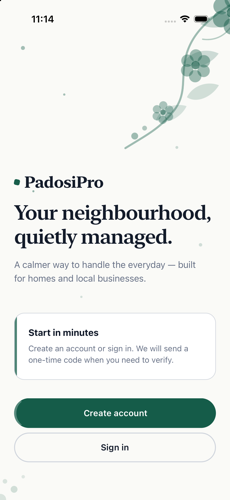
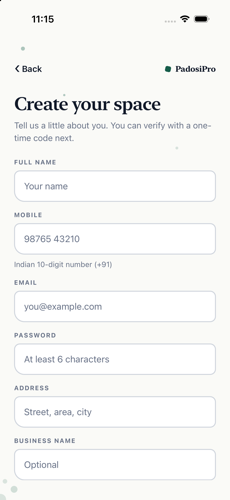
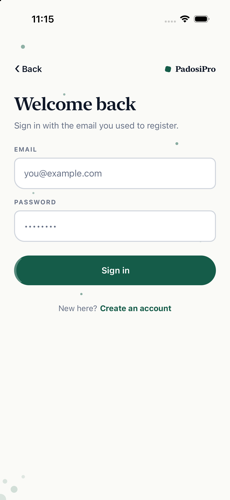
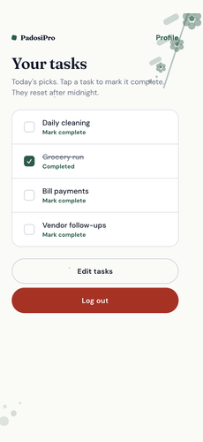
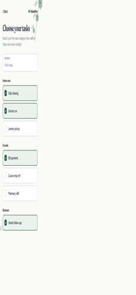
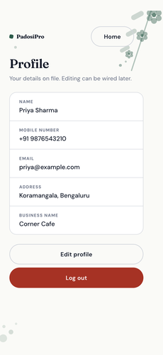

# PadosiPro

Neighborhood task helper: Expo (React Native) mobile app + Express API, Postgres, and Redis.

## Screenshots

| Welcome | Create account | Sign in |
| --- | --- | --- |
|  |  |  |

| Home | Tasks | Profile |
| --- | --- | --- |
|  |  |  |

## Prerequisites

- Node.js 22+
- npm
- Docker / Docker Compose
- Expo Go **or** Xcode / Android Studio for simulators

## 1. Run the API (Docker)

```bash
cp backend/.env.example backend/.env
# SMTP is optional — leave SMTP_USER / SMTP_PASS empty to use Mailpit

docker compose up --build
```

- API: `http://localhost:3003`
- Mailpit UI (OTP inbox): `http://localhost:8025`

If you set `SMTP_USER` and `SMTP_PASS` in `backend/.env`, real SMTP is used instead of Mailpit.

## 2. Run the Expo app

```bash
cp app/.env.example app/.env
# EXPO_PUBLIC_API_URL should point at your API (default: http://localhost:3003)

cd app
npm install
npx expo start
```

Then open iOS Simulator (`i`), Android emulator (`a`), or scan the QR code with Expo Go.

On a physical device, use your machine’s LAN IP instead of `localhost` (e.g. `http://192.168.x.x:3003`).

### Happy path

Register → copy OTP from Mailpit (`http://localhost:8025`) or your inbox → confirm profile → choose daily tasks → home.

## Environment variables

**Never commit secrets.**

### `backend/.env`

| Variable | Purpose |
| --- | --- |
| `SMTP_USER` / `SMTP_PASS` | Real SMTP auth (empty → Mailpit fallback) |
| `SMTP_HOST` / `SMTP_PORT` / `SMTP_SECURE` | Real SMTP connection |
| `SMTP_MAIL_FROM` | From address for OTPs |
| `MAILPIT_HOST` / `MAILPIT_PORT` | Mailpit SMTP (Compose sets host to `mailpit`) |
| `DATABASE_URL` | Postgres (Compose sets this if omitted) |
| `REDIS_URL` | Redis (Compose sets this if omitted) |
| `JWT_SECRET` / `JWT_EXPIRES_IN` | Auth tokens |
| `BCRYPT_SALT_ROUNDS` | Password hashing |
| `PORT` | API port (default `3003`) |

### `app/.env`

| Variable | Purpose |
| --- | --- |
| `EXPO_PUBLIC_API_URL` | API base URL (e.g. `http://localhost:3003`) |

## Project layout

- `app/` — Expo Router mobile client
- `backend/` — Express API, auth, OTP, migrations
- `docker-compose.yml` — Postgres, Redis, Mailpit, API

## Demo video
https://github.com/user-attachments/assets/5ea67440-d561-4bcf-805f-630ca258d5cb
